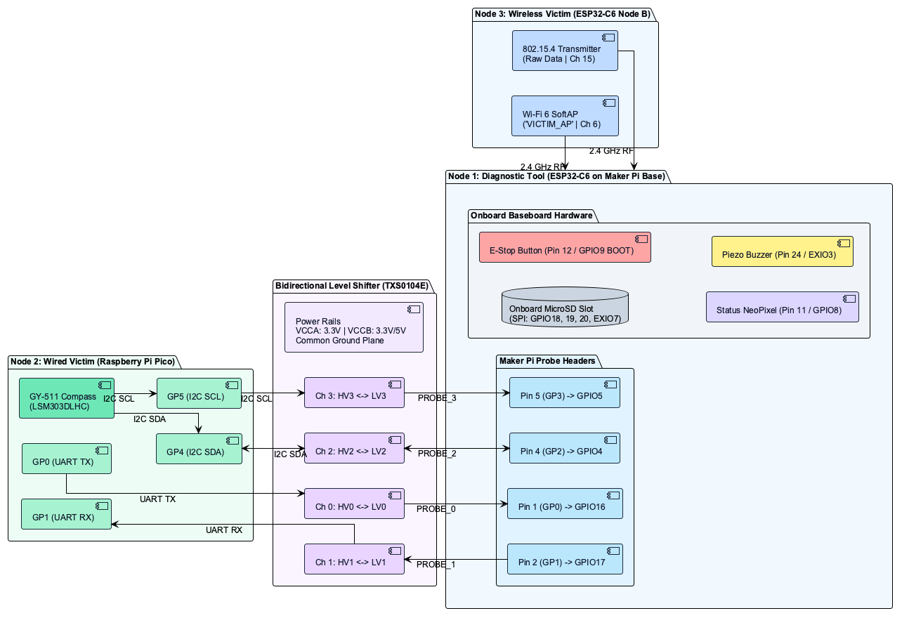
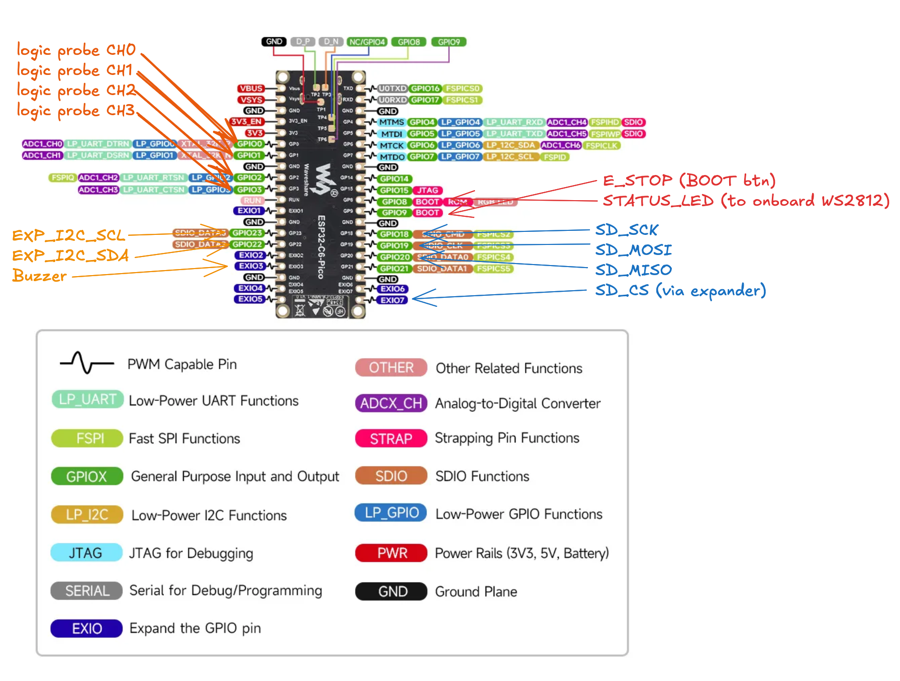
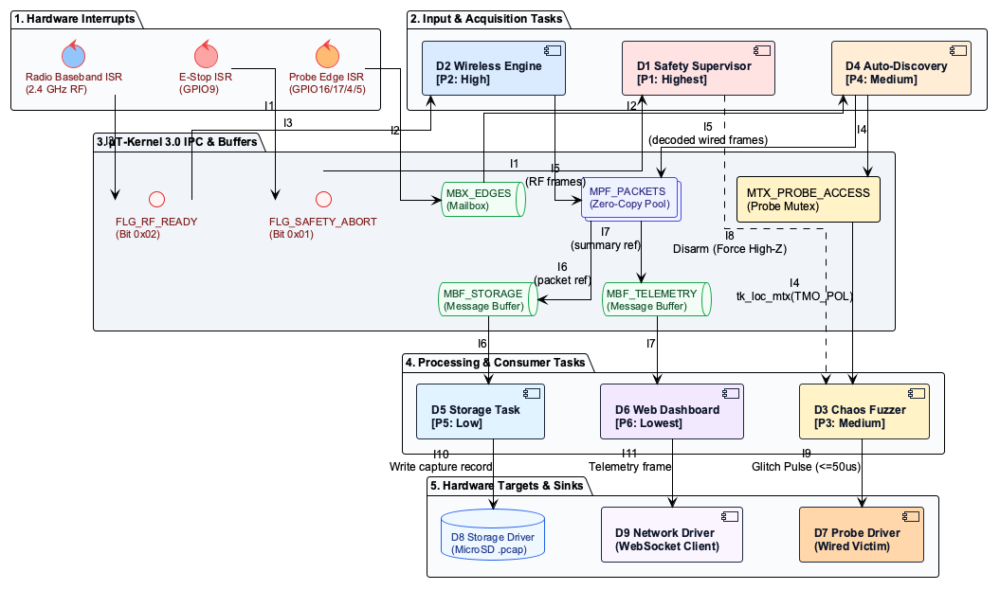
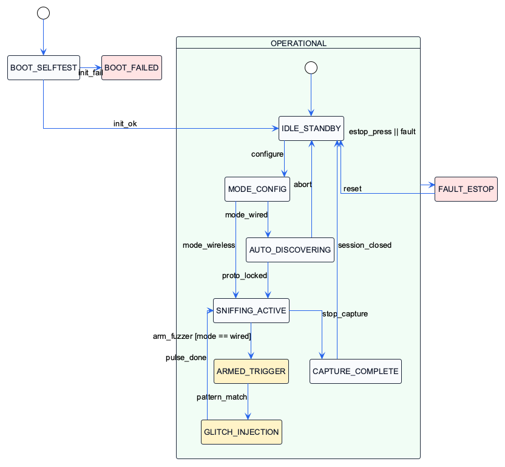
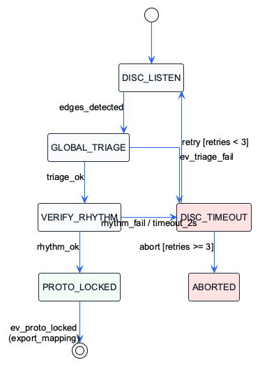
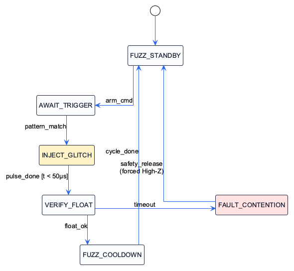
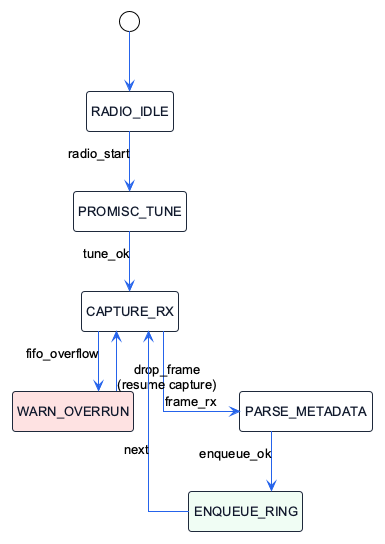

# Design Review: whattheflip

**Module:** INF2004 Embedded Systems Programming  
**Group ID:** SE06 (Lab P1)  
**Project Title:** whattheflip — Embedded Multi-Bus Sniffer, Wireless Monitor & Chaos Fuzzer  
**Target Hardware:** 2 × ESP32-C6 RISC-V @ 160 MHz (diagnostic tool + wireless victim) + Raspberry Pi Pico (RP2040) wired victim; GY-511 I2C sensor target  
**Operating System:** $\mu\text{T-Kernel}$ 3.0 (`esp32c6-mtk3`)  
**Submission Milestone:** Week 6 Architecture Freeze  

---

## Purpose

Document the system requirements, hardware connections, RTOS task structure, behavioural models, assumptions, and AI-supported design reasoning before major implementation. Treat this Week 6 submission as an architecture freeze before full integration and Tribunal 1. The design may change later, but major changes must be justified with engineering evidence.

---

## Team Role and Subsystem Ownership

| Buddy       | Student Name | Student ID      | Primary Subsystem / Responsibility                                                                                                                                                                                                              |
| ----------- | ------------ | --------------- | ----------------------------------------------------------------------------------------------------------------------------------------------------------------------------------------------------------------------------------------------- |
| **Buddy 1** | Tan Yan Qi   | *Student Entry* | **Wired Protocol Auto-Discovery Engine:** 4-pin signal timing acquisition, rise-time measurement, UART/I2C/SPI classification, and dynamic pin role mapping.                                                                                    |
| **Buddy 2** | Annie Goh    | *Student Entry* | **Physical Chaos & Fault Injection Engine:** Frame-synchronized glitch injection (bit-flips, I2C ACK suppression, clock stretching), bus contention protection, and hardware E-stop driver release.                                             |
| **Buddy 3** | Zayne Lee    | *Student Entry* | **Wireless Multi-Protocol Sniffer Engine:** ESP32-C6 2.4 GHz promiscuous radio capture for Wi-Fi 6 (802.11ax) management frames and IEEE 802.15.4 (Zigbee 3.0), extracting RSSI, channel, and timestamps.                                       |
| **Buddy 4** | Ryan Ke      | *Student Entry* | **Telemetry Ingestion & PCAP Storage Engine:** Zero-copy fixed memory ring buffers, packet serialization into standard `libpcap` format (`.pcap`), and high-speed FAT32 MicroSD card logging.                                                   |
| **Buddy 5** | Joseph Poon  | *Student Entry* | **System Supervisor, Web UI & Victim Control:** $\mu\text{T-Kernel}$ supervisor coordination, WebSocket live streaming dashboard over local Wi-Fi, hardware E-stop interrupt handling, NeoPixel/buzzer indicators, and victim stimulus control. |

---

## 1. Requirements

### 1.1 Functional Requirements (FR)

| ID | Requirement Statement |
|---|---|
| **R-1.1** | The system shall passively acquire digital signals across 4 probe pins with an input leakage current $\le 1\,\mu\text{A}$ ($R_{in} \ge 1\text{ M}\Omega$) and a timing resolution $\le 1\,\mu\text{s}$. |
| **R-1.2** | The system shall classify UART ($9600\text{ to }115200\text{ baud} \pm 2\%$), I2C ($100\text{ kHz} \pm 2\%$ and $400\text{ kHz} \pm 2\%$), and SPI (clock rates up to $1\text{ MHz}$) signals within $\le 500\text{ ms}$ of continuous bus activity, with a classification accuracy $\ge 95\%$. |
| **R-1.3** | The system shall remap any of the 4 probe pins to any internal protocol decoding channel without physical rewiring, with a remap-to-ready latency $\le 10\text{ ms}$. |
| **R-2.1** | The system shall capture 802.11 management frames (beacons, probe requests) and IEEE 802.15.4 frames across 2.4 GHz channels 11–26, extracting received signal strength (RSSI, $\pm 3\text{ dB}$), channel ID, and timestamps ($\pm 1\,\mu\text{s}$). |
| **R-3.1** | When armed by the user, the system shall inject bounded protocol faults into the target bus — single bit-inversions, I2C ACK $\to$ NACK suppressions, and clock stretching up to $50\,\mu\text{s} \pm 10\%$ — with each active drive bounded to $\le 50\,\mu\text{s}$ before releasing the line. |
| **R-3.2** | When armed by the user, the system shall transmit over-the-air stress frames (including 802.11 deauthentication frames) targeting the testbed wireless node, within $\le 100\text{ ms}$ of the arm command. |
| **ER-1** | On actuation of the emergency stop input, the system shall disarm all active output drivers and return all probe lines to high-impedance (High-Z) within $\le 5\text{ ms}$. |
| **R-4.1** | The system shall record captured packets, each with a timestamp ($\pm 1\,\mu\text{s}$) and raw packet bytes, to non-volatile removable media in a format importable by standard packet-analysis tooling. |
| **R-5.1** | The system shall broadcast decoded packet summaries and bus error statistics over a local wireless interface to connected client dashboards at a refresh period of $500\text{ ms to }1000\text{ ms}$ ($\pm 10\%$), and shall issue a fault-state alert within $\le 200\text{ ms}$ of the fault event. |

### 1.2 Non-Functional Requirements (NFR)

| ID | Requirement Statement |
|---|---|
| **NFR-1** | The emergency stop and safety disarm path shall preempt all background processing within $\le 5\text{ ms}$ of switch contact. |
| **NFR-2** | The firmware shall perform zero dynamic heap allocations during active monitoring and fault-injection phases (0 allocations measured over a $\ge 10\text{ min}$ continuous run). |
| **NFR-3** | The capture pipeline shall sustain a $\le 0.1\%$ packet drop rate for continuous wired streams up to $500\text{ kbps}$, and shall buffer wireless bursts of $\ge 32$ consecutive frames without loss. |
| **NFR-4** | The probe interface shall tolerate continuous input voltages up to $5.5\text{ V} \pm 5\%$ without presenting more than $3.6\text{ V}$ to any microcontroller pad. |
| **NFR-5** | Fault-injection pulses shall synchronize to target bus trigger edges with a timing jitter of $< 500\text{ ns}$. |

---

## 2. Hardware Integration Pin Layout

### 2.1 Hardware Interconnect & Maker Pi Pico Base Integration

The diagnostic tool (Node 1) consists of the **Waveshare ESP32-C6-Pico-M** mounted directly onto the **Cytron Maker Pi Pico Base** carrier board. This integration provides three major hardware advantages:
1. **Integrated MicroSD Card Socket:** Utilizes the onboard spring-push MicroSD slot hardwired to physical pins 14–16, eliminating loose external SPI breakout modules.
2. **Per-Pin Real-Time LED Diagnostics:** Every GPIO header pin on the Maker Pi Base features an onboard blue LED indicator, providing immediate physical visual feedback when probe lines and SPI buses toggle.
3. **Electrical Safety Invariant (I2C Bus Protection):** On the ESP32-C6-Pico, physical pins 26 and 27 connect to native `GPIO22` (SDA) and `GPIO23` (SCL), which drive the onboard TCA9554PWR expander. The Maker Pi base exposes its onboard user buttons on the header positions mapped to `GP20`, `GP21`, and `GP22`; on this carrier those nets are tied to the expander/I2C domain. The team has therefore mandated using the **native `BOOT` pushbutton on Pin 12 (`GPIO9`)** for Emergency Stop, and leaves all three Maker Pi base user buttons (`GP20`/`GP21`/`GP22`) unused so none can short or contend the expander's I2C bus.

**Figure 1: Hardware Interconnect & Maker Pi Base Pinout**

**Figure 1b: Node 1 ESP32-C6 Pin Allocation (annotated)**

### 2.2 Pin Allocation Table (Maker Pi Base Carrier Integration)

| Device / Module                  | Signal Name  | Sensor label        | ESP32-C6 GPIO Pin | Interface            | Notes / RTOS Task Owner                                                                                                                                                   |
| -------------------------------- | ------------ | ------------------- | :---------------: | -------------------- | ------------------------------------------------------------------------------------------------------------------------------------------------------------------------- |
| Wired-probe channel 0            | `PROBE_0`    | `GP0` (Pin 1)       |     **GPIO0**     | GPIO / Edge IRQ      | Shared (`AutoDiscovery` / `Fuzzer`). Native GPIO level-shifted to Wired Victim. Baseboard blue LED indicator.                                                             |
| Wired-probe channel 1            | `PROBE_1`    | `GP1` (Pin 2)       |     **GPIO1**     | GPIO / Edge IRQ      | Shared (`AutoDiscovery` / `Fuzzer`). Native GPIO level-shifted to Wired Victim. Baseboard blue LED indicator.                                                             |
| Wired-probe channel 2            | `PROBE_2`    | `GP2` (Pin 4)       |     **GPIO2**     | GPIO / Edge IRQ      | Shared (`AutoDiscovery` / `Fuzzer`). Native GPIO level-shifted to Wired Victim SDA. Baseboard blue LED indicator.                                                         |
| Wired-probe channel 3            | `PROBE_3`    | `GP3` (Pin 5)       |     **GPIO3**     | GPIO / Edge IRQ      | Shared (`AutoDiscovery` / `Fuzzer`). Native GPIO level-shifted to Wired Victim SCL. Baseboard blue LED indicator.                                                         |
| Maker Pi onboard MicroSD slot    | `SD_SCK`     | `GP10` (Pin 14)     |    **GPIO18**     | Hardware SPI         | `Storage_Task`. **Hardwired to Maker Pi onboard MicroSD slot**. 10 MHz SPI Clock.                                                                                         |
| Maker Pi onboard MicroSD slot    | `SD_MOSI`    | `GP11` (Pin 15)     |    **GPIO19**     | Hardware SPI         | `Storage_Task`. **Hardwired to Maker Pi onboard MicroSD slot**. SPI Master Out Slave In.                                                                                  |
| Maker Pi onboard MicroSD slot    | `SD_MISO`    | `GP12` (Pin 16)     |    **GPIO20**     | Hardware SPI         | `Storage_Task`. **Hardwired to Maker Pi onboard MicroSD slot**. SPI Master In Slave Out.                                                                                  |
| TCA9554PWR IO expander           | `SD_CS`      | `GP15` (Pin 20)     |     **EXIO7**     | IO Expander / CS     | `Storage_Task`. **Hardwired to Maker Pi onboard MicroSD slot**. Active-Low Chip Select via TCA9554.                                                                       |
| ESP32-C6-Pico BOOT pushbutton    | `E_STOP_BTN` | `BOOT` (Pin 12/GP9) |     **GPIO9**     | GPIO Input (Pull-Up) | `Safety_Supervisor_Task`. **Onboard BOOT pushbutton**. Active-Low, $\le 5\text{ ms}$ High-Z interrupt (avoids I2C short).                                                 |
| ESP32-C6-Pico onboard WS2812     | `STATUS_LED` | `RGB_LED` (GPIO8)   |     **GPIO8**     | WS2812 / DIN         | `Safety_Supervisor_Task`. **ESP32-C6-Pico onboard WS2812 Addressable RGB LED** (Green: Ready, Blue: Sniff, Red: Fault). GPIO8 is a strapping pin; driven only after boot. |
| Maker Pi onboard piezo buzzer    | `BUZZER_OUT` | `Buzzer` (Pin 24)   |     **EXIO3**     | PWM / Audio          | `Safety_Supervisor_Task`. Maker Pi Base onboard piezo buzzer, driven via the TCA9554 expander (EXIO3).                                                                    |
| TCA9554PWR IO expander           | `EXP_I2C`    | `GP22/GP23` (26/27) |  **GPIO22 / 23**  | I2C Master Bus       | System Init. Dedicated to onboard TCA9554PWR expander. **Baseboard Buttons 1 & 2 must NOT be pressed**.                                                                   |
| TXS0104E level shifter (LV rail) | `VCC_LV`     | `3V3` (Pin 36)      |    **3V3 OUT**    | Power Output         | Hardware Interconnect. 3.3V reference power to low-voltage side of TXS0104E level shifter.                                                                                |
| Common ground plane              | `GND`        | `GND` (Pin 38)      |      **GND**      | Ground Plane         | Hardware Interconnect. Common reference ground unified across Maker Pi Base, Level Shifter, and Pico Victim.                                                              |

---

## 3. RTOS Task Table ($\mu\text{T-Kernel}$ 3.0)

*Control-logic tasks do not access GPIO/radio/SPI registers directly; all hardware access is mediated by thin driver modules (`D7`–`D9`), keeping the control and peripheral layers separated.*

| Box ID | Task Name                | Purpose                                                                      | Inputs                                      | Outputs                                                      | Trigger                           |    Priority     |
| :----: | ------------------------ | ---------------------------------------------------------------------------- | ------------------------------------------- | ------------------------------------------------------------ | --------------------------------- | :-------------: |
| **D1** | `Safety_Supervisor_Task` | Monitor emergency stop, system faults, and enforce High-Z probe isolation    | GPIO9 E-stop IRQ, watchdog, bus short flags | High-Z disarm request to probe driver, RGB LED, buzzer       | Event-driven (IRQ / Fault flag)   | **Highest (1)** |
| **D2** | `Wireless_Engine_Task`   | Drain 2.4 GHz radio baseband FIFOs and extract packet metadata               | Radio promiscuous RX baseband event         | Ingest packet records into memory pool                       | Event-driven (Radio Baseband IRQ) |  **High (2)**   |
| **D3** | `Chaos_Fuzzer_Task`      | Inject synchronized glitch pulses into target bus transmissions              | Trigger pattern config, edge events         | Timed glitch pulse request to probe driver (bit-flip / NACK) | Event-driven (Frame sync event)   | **Medium (3)**  |
| **D4** | `AutoDiscovery_Task`     | Sample edge transitions, measure pulse widths, and resolve pin mappings      | Probe edge FIFO timestamps                  | Resolved protocol ID, pin role table                         | Periodic (50 ms) / Edge event     | **Medium (4)**  |
| **D5** | `Storage_Task`           | Serialize packet buffers to capture files on removable media                 | Ingested packet records from message buffer | Disk sector writes via storage driver                        | Event-driven (Buffer threshold)   |   **Low (5)**   |
| **D6** | `Web_Dashboard_Task`     | Serve dashboard assets and stream live telemetry over the wireless interface | Decoded packet headers, bus error stats     | Telemetry frames to network driver                           | Periodic (500–1000 ms)            | **Lowest (6)**  |

#### Priority and Ownership Justification:
`Safety_Supervisor_Task` is allocated Priority 1 (highest) to guarantee that an emergency stop actuation or electrical contention event preempts all other tasks within $\le 5\text{ ms}$, immediately floating all probe pins to protect connected target hardware. `Wireless_Engine_Task` is set to Priority 2 to prevent hardware radio FIFO overruns during dense 802.11 beacon bursts. `Chaos_Fuzzer_Task` sits at Priority 3 to ensure deterministic, sub-microsecond glitch timing when a target frame trigger is recognized. `AutoDiscovery_Task` sits at Priority 4 to perform edge timing analysis without preempting active frame capture. `Storage_Task` and `Web_Dashboard_Task` are assigned the lowest priorities (5 and 6) because disk and network operations are decoupled through pre-allocated fixed memory pools (`MPF_PACKETS`), ensuring slow SD card sector writes never block time-critical bus sampling.

---

## 4. Task Interaction Diagram
**Figure 2: µT-Kernel 3.0 Task Interaction & IPC Architecture**

#### Interface Payloads (unique IDs):
Every interface arrow in Figure 2 carries a unique ID and a specific payload. ISRs perform no blocking work and no `printf`; they only timestamp/capture and signal via an event flag or mailbox, deferring all processing to tasks.

| Interface ID | From → To | Payload / Data-Control |
|:---:|---|---|
| **I1** | E-Stop ISR → `D1` Safety Supervisor | EventFlag `FLG_SAFETY_ABORT` (bit set, no payload) |
| **I2** | Probe Edge ISR → `D4` Auto-Discovery | Mailbox `MBX_EDGES` (edge timestamp records) |
| **I3** | Radio ISR → `D2` Wireless Engine | EventFlag `FLG_RF_READY` + pool buffer handle |
| **I4** | `D4` ⇄ `D3` (Discovery ⇄ Fuzzer) | Mutex `MTX_PROBE_ACCESS` (probe-line ownership token) |
| **I5** | `D2`/`D4` → Fixed Pool `MPF_PACKETS` | Pool buffer acquire (`tk_get_mpf`), zero-copy packet record |
| **I6** | `MPF_PACKETS` → `D5` Storage | Message Buffer `MBF_STORAGE` (packet record reference) |
| **I7** | `MPF_PACKETS` → `D6` Web Dashboard | Message Buffer `MBF_TELEMETRY` (summary record reference) |
| **I8** | `D1` Safety Supervisor → `D3` Fuzzer | Disarm command (force High-Z, abort injection) |
| **I9** | `D3` Fuzzer → Probe Driver (`D7`) | Timed glitch pulse request (bounded $\le 50\,\mu\text{s}$) |
| **I10** | `D5` Storage → Storage Driver (`D8`) | Sector-write request (capture record) |
| **I11** | `D6` Web Dashboard → Network Driver (`D9`) | Telemetry frame to wireless interface |

#### Explanation of Main Communication Paths:
1. **Safety Interrupt Path (I1, I8, I9):** When the E-stop input falls LOW, the `E-Stop ISR` sets EventFlag `FLG_SAFETY_ABORT` (and does nothing else — no register writes, no `printf`), waking `D1` (Priority 1). `D1` issues a High-Z disarm request to the probe driver module, which floats all probe pins to High-Z within $\le 5\text{ ms}$. Routing the actual pin-direction change through the thin probe driver (rather than `D1` touching output-enable registers directly) keeps control logic separated from peripheral access; the driver call is a bounded, non-blocking register write sized to meet the $\le 5\text{ ms}$ budget.
2. **Probe Arbitration & Timing Path (I2, I4):** `Probe Edge ISR` captures hardware timer timestamps and enqueues them via Mailbox `MBX_EDGES` to `D4`. Probe pin access between discovery and fuzzing is serialized via Mutex `MTX_PROBE_ACCESS`.
3. **Zero-Copy Ingestion & Storage Pipeline (I3, I5, I6, I7):** When the `Radio ISR` receives a frame, it acquires a buffer from Fixed Memory Pool `MPF_PACKETS` (no dynamic allocation) and signals `D2`. The populated packet is referenced into Message Buffers `MBF_STORAGE` and `MBF_TELEMETRY`. Even if a removable-media write incurs a $\sim 30\text{ ms}$ latency spike, the pre-allocated pool absorbs incoming bursts without dropping frames.

---

## 5. System-Level Statechart
**Figure 3: Unified System-Level Statechart**

#### Main States and Assumptions:
* `BOOT_SELFTEST`: Verifies MicroSD card mounting, SPI communication, and radio baseband initialization. Transitions to `BOOT_FAILED` if hardware initialization fails.
* `BOOT_FAILED`: Terminal fault state halting system execution with a blinking red LED if critical boot hardware is unreadable.
* `IDLE_STANDBY`: Default safe operational state. Probe pins are configured as High-Z inputs; fuzzer output drivers are completely disabled.
* `MODE_CONFIG`: Processes user configuration commands to set operating profiles (Wired vs. Wireless, RF channels, or baud search parameters).
* `AUTO_DISCOVERING`: Measures edge counts, pulse widths, and clock period stability across the 4 probes to resolve protocol type and pinout.
* `SNIFFING_ACTIVE`: Ingests packet streams into zero-copy memory pools, writing `.pcap` files to MicroSD and broadcasting live WebSocket telemetry.
* `ARMED_TRIGGER`: Fuzzer armed; synchronizes to target bus framing and awaits a matched address/header trigger pattern.
* `GLITCH_INJECTION`: Injects a precision in-flight glitch pulse (bit-flip or ACK suppression bounded to $t < 50\,\mu\text{s}$) and verifies bus release.
* `CAPTURE_COMPLETE`: Flushes remaining packet ring buffers to MicroSD and closes active PCAP sessions before returning to `IDLE_STANDBY`.
* `FAULT_ESTOP`: Global emergency preemption state invoked by physical E-stop press or bus contention. Forces all probe lines to High-Z in $\le 5\text{ ms}$, sounds buzzer, and latches until manually reset.
---

## 6. Subsystem Statecharts

### 6.1 Subsystem Statechart 1: Wired Auto-Discovery Engine

* **Subsystem Name:** Wired Protocol Auto-Discovery Engine
* **Related RTOS Task:** `AutoDiscovery_Task` (`TSK_DISCOVERY`)
* **Purpose:** Passively classify unknown bus protocols and resolve signal pin assignments.
* **Reason a Statechart is Needed:** Enforces a multi-stage sequential filter (pin triage $\to$ rhythm verification $\to$ confirmation) to reject noise spikes and prevent false protocol locks.
**Figure 4: Subsystem 1 — Wired Auto-Discovery Statechart**

#### States, Events, and Fault Handling:
* `DISC_LISTEN`: Samples probe transitions. Upon receiving edge interrupts, moves to `GLOBAL_TRIAGE`.
* `GLOBAL_TRIAGE`: Applies exclusivity rules (1 pin = UART candidate, 2 pins = I2C candidate, 3–4 pins = SPI candidate). If active pin count is invalid, triggers `ev_triage_fail`.
* `VERIFY_RHYTHM`: Evaluates baud rate pulse widths ($\pm 5\%$ tolerance) or I2C clock period stability ($\pm 25\%$ jitter bound).
* `PROTO_LOCKED`: Emits `ev_proto_locked`, updates shared pinout tables, and releases `MTX_PROBE_ACCESS`.
* **Fault Handling:** If rhythm verification fails or no valid protocol locks within $2\text{ s}$, transitions to `DISC_TIMEOUT`, notifies the dashboard, and retries up to 3 times before resetting to `DISC_LISTEN`.

---

### 6.2 Subsystem Statechart 2: Chaos Fuzzing Engine

* **Subsystem Name:** Physical Chaos & Fault Injection Engine
* **Related RTOS Task:** `Chaos_Fuzzer_Task` (`TSK_FUZZER`)
* **Purpose:** Inject synchronized non-destructive faults (bit-flips, ACK suppression, clock stretching) into active bus traffic.
* **Reason a Statechart is Needed:** Guarantees that active electrical drive is strictly bounded in time, preventing bus shorts or damaged target drivers.
**Figure 5: Subsystem 2 — Chaos Fuzzing Engine Statechart**

#### States, Events, and Fault Handling:
* `FUZZ_STANDBY`: Probes remain in High-Z mode until user issues arm command.
* `AWAIT_TRIGGER`: Evaluates incoming bytes to synchronize with the target frame header.
* `INJECT_GLITCH`: Drives the probe line for a single bit duration (e.g. $8.68\,\mu\text{s}$ at 115200 baud).
* `VERIFY_FLOAT`: Re-samples line state to ensure the line returned to idle HIGH.
* **Fault Handling:** If a line remains driven or pulled LOW for $> 100\,\mu\text{s}$, `FAULT_CONTENTION` is asserted, immediately switching all outputs to High-Z and alerting `Safety_Supervisor_Task`.

---

### 6.3 Subsystem Statechart 3: Wireless Multi-Protocol Sniffer

* **Subsystem Name:** Wireless Multi-Protocol Sniffer Engine
* **Related RTOS Task:** `Wireless_Engine_Task` (`TSK_WIRELESS`)
* **Purpose:** Intercept raw 802.11 and 802.15.4 packets and extract RF physical metadata.
* **Reason a Statechart is Needed:** Manages radio baseband transitions and provides graceful degradation during high-throughput packet bursts.
**Figure 6: Subsystem 3 — Wireless Multi-Protocol Sniffer Statechart**

#### States, Events, and Fault Handling:
* `RADIO_IDLE`: Radio disabled; power consumption minimized.
* `PROMISC_TUNE`: Configures channel filter and engages promiscuous mode.
* `CAPTURE_RX`: Drains hardware baseband FIFO upon packet arrival.
* `PARSE_METADATA`: Extracts RSSI, channel ID, and microsecond timestamps into standard PCAP frame format.
* **Fault Handling:** If the fixed memory pool reaches $> 85\%$ capacity, non-critical broadcast data frames are dropped while management/control frames are preserved, logging an overrun warning to telemetry.

---

## 7. Assumptions

| ID     | Assumption                                                                                                                                                      | Risk if Wrong                                                                    | Validation Method                                                                                                                              | Owner       | Status |
| ------ | --------------------------------------------------------------------------------------------------------------------------------------------------------------- | -------------------------------------------------------------------------------- | ---------------------------------------------------------------------------------------------------------------------------------------------- | ----------- | :----: |
| **A1** | Probe inputs resolve clean CMOS logic thresholds ($V_{IL} \le 0.8\text{ V}, V_{IH} \ge 2.0\text{ V}$) without excessive ringing on $15\text{ cm}$ jumper lines. | Edge noise triggers spurious interrupts, causing false baud rate detection.      | Capture 100 kHz I2C transitions on an oscilloscope with 15 cm leads; verify rise time $t_r \le 300\text{ ns}$ and no false trigger interrupts. | Tan Yan Qi  |  Open  |
| **A2** | ESP32-C6 GPIO pins can switch direction from High-Z Input to Driven Output in $< 1\,\mu\text{s}$ for targeted bit glitching.                                    | Delayed output drive misses the target clock pulse, failing to inject the fault. | Program a GPIO toggle triggered by an external pulse; measure drive delay on an oscilloscope with $< 50\text{ ns}$ resolution.                 | Annie Goh   |  Open  |
| **A3** | The ESP32-C6 promiscuous packet filter captures raw 802.11 management frames without dropping frames at burst rates up to 50–100 pkts/s.                        | Dropped beacon frames cause incomplete Wireshark trace exports.                  | Blast the sniffer with a 100 pkt/s beacon generator (Node 3); compare transmitted vs. logged frame sequence counters.                          | Zayne Lee   |  Open  |
| **A4** | SPI FAT32 MicroSD write latency spikes ($\le 40\text{ ms}$) can be fully absorbed by an 8 KB pre-allocated packet ring buffer.                                  | Buffer overflow during SD write stalls drops incoming physical/wireless packets. | Simulate a 50 ms SD write stall while streaming UART traffic at 115200 baud; verify zero dropped bytes in memory logs.                         | Ryan Ke     |  Open  |
| **A5** | The WebSocket telemetry server can stream 1–2 Hz packet updates over Wi-Fi without starving the $\mu\text{T-Kernel}$ scheduler.                                 | Network stack CPU load introduces jitter into physical bus sampling.             | Benchmark system timer jitter while serving 3 concurrent WebSocket clients running telemetry streams at 1 Hz.                                  | Joseph Poon |  Open  |
| **A6** | ESP-IDF on the ESP32-C6 permits raw 802.11 frame transmission (`esp_wifi_80211_tx`) of deauthentication frames against the testbed victim node, without being silently filtered by the stack. | Deauth stress injection (R-3.2) cannot be demonstrated; feature must drop to stretch scope. | Transmit a crafted deauth frame at the testbed SoftAP (Node 3) and confirm via the sniffer that the frame is emitted and the victim re-associates; if filtered, fall back to 802.15.4-only stress or beacon-flood. | Zayne Lee / Annie Goh |  Open  |

---

## 8. AI-Supported Design Evidence

### 8.1 Pre-Submission AI Ideation

| Buddy       | AI Prompt or Discussion Used                                                                          | Useful AI Ideas                                                                                                           | Weak or Unrealistic AI Ideas                                                         | Team Decision                                                                                                                        |
| ----------- | ----------------------------------------------------------------------------------------------------- | ------------------------------------------------------------------------------------------------------------------------- | ------------------------------------------------------------------------------------ | ------------------------------------------------------------------------------------------------------------------------------------ |
| **Buddy 1** | Prompted AI on multi-pin signal triage heuristics for mixed UART and I2C lines.                       | AI proposed the "Global Pin Exclusivity Filter" (counting active lines before calculating timings).                       | AI suggested using a neural network classifier on the Pico to identify protocols.    | Adopted the deterministic pulse-width heuristic; rejected neural networks as an unnecessary compute and memory burden.               |
| **Buddy 2** | Asked AI how to safely inject in-flight faults on open-drain I2C buses without frying master drivers. | AI suggested driving lines strictly during slave ACK clock pulses and adding an immediate High-Z release timeout.         | AI suggested cutting the physical VCC line with a MOSFET to simulate device failure. | Implemented software-timed ACK suppression and physical E-stop High-Z override; rejected cutting VCC to prevent back-powering chips. |
| **Buddy 3** | Inquired whether ESP32-C6 can sniff connected BLE data channels promiscuously.                        | AI identified that ESP-IDF only supports BLE GAP advertisement scanning, not raw data channel sniffing.                   | AI initially claimed BLE promiscuous mode existed via standard APIs.                 | Critiqued and dropped Bluetooth link-layer sniffing; scoped wireless strictly to native Wi-Fi 6 + 802.15.4 promiscuous capture.      |
| **Buddy 4** | Asked AI how to log high-rate packet streams to MicroSD without missing real-time deadlines.          | AI suggested using pre-allocated fixed memory pools (`MPF`) and message buffers to decouple capture from SD block writes. | AI suggested writing raw text JSON strings to the SD card for each captured packet.  | Adopted zero-copy fixed memory pools; rejected JSON in favor of compact binary `libpcap` format.                                     |
| **Buddy 5** | Asked AI to evaluate whether a 0.96" OLED display should be included alongside the Wi-Fi dashboard.   | AI highlighted that the OLED consumes 1 KB RAM, bus bandwidth, and cannot render complex hex packet trees.                | AI suggested keeping both OLED and Web dashboard for redundancy.                     | Completely dropped the OLED screen; allocated resources to the WebSocket web dashboard and status NeoPixel.                          |

### 8.2 Team-Reviewed Architecture Freeze

| AI or Initial Idea                                                                  | Team Decision | Engineering Reason                                                                                                                           | Affected Artefact                                         |
| ----------------------------------------------------------------------------------- | ------------- | -------------------------------------------------------------------------------------------------------------------------------------------- | --------------------------------------------------------- |
| Use a 3-node closed-loop testbed (Tool + Wired Victim + Wireless Victim).           | Accepted      | Proves technical scope with dedicated, repeatable hardware; eliminates reliance on noisy campus Wi-Fi or uncontrolled targets.               | Testbed topology, System overview, Hardware pinout        |
| Mount ESP32-C6 on Cytron Maker Pi Pico Base carrier board.                          | Accepted      | Eliminates external MicroSD breakout module by utilizing onboard SD slot; provides per-pin blue LED diagnostics and clean benchtop mounting. | Hardware pinout table, Schematic, Bill of Materials       |
| Drop 0.96" OLED display in favor of Wi-Fi WebSocket dashboard.                      | Accepted      | Eliminates I2C bus contention, saves 1 KB RAM, and provides far superior visual clarity during zoom tribunals.                               | Bill of Materials, Pinout table, Task table               |
| Mandate bidirectional 3.3V $\leftrightarrow$ 5V logic level shifter on probe lines. | Accepted      | RP2040 and ESP32-C6 pads have a 3.6V maximum limit; connecting 5V targets directly causes over-voltage destruction.                          | Hardware integration table, Schematic, NFR-4               |
| Omit Bluetooth (BLE) promiscuous mode from the project scope.                       | Accepted      | Standard ESP-IDF lacks raw link-layer BLE sniffing APIs; initializing NimBLE consumes 45 KB SRAM and 200 KB flash.                           | Protocol matrix, Wireless requirements, Task architecture |

### 8.3 Final AI-Vetted Gap Check

* **AI Reviewer Prompt Used:** *"Act as a strict embedded systems reviewer for whattheflip. Check requirements, pinout, RTOS task table, IPC architecture, statecharts, assumptions, and consistency. Identify missing requirements, unclear interfaces, untested assumptions, timing risks, task conflicts, and shared-resource problems."*

| AI-Identified Gap | Team Response | Action Taken | Evidence or Reason |
|---|---|---|---|
| Maker Pi Base buttons on GP20/GP21/GP22 tie to the TCA9554 expander I2C domain. | **Fixed** | Mandated the native BOOT switch on Pin 12 (`GPIO9`) for Emergency Stop, and left all three Maker Pi base user buttons unused. | Hardware integration Section 2.2 (pin table + safety invariant note). |
| Unclear probe line ownership between Auto-Discovery and Fuzzing tasks. | **Fixed** | Defined dynamic probe sharing arbitrated via Mutex `MTX_PROBE_ACCESS`. | Task table Section 3 and IPC diagram Section 4 updated. |
| MicroSD card write latency spikes ($\le 40\text{ ms}$) may cause buffer overrun during burst captures. | **Needs Validation** | Sized fixed memory pool (`MPF_PACKETS`) to 8 KB to buffer up to 32 consecutive frames; validated via Assumption A4. | Assumption A4 documented with simulated 50 ms stall benchmark. |
| Single 2.4 GHz RF front-end cannot capture Wi-Fi and 802.15.4 simultaneously. | **Accepted as Risk** | Documented time-multiplexed capture constraint; system operates in distinct Wi-Fi or Zigbee listening modes. | Documented in Section 2 and Subsystem Statechart 3. |

---

## 9. Design Consistency

* **Which task owns each hardware device?**
  * `AutoDiscovery_Task` and `Chaos_Fuzzer_Task` dynamically share the 4 target probe lines on Maker Pi Pins 1, 2, 4, 5 (ESP32-C6 `GPIO0`, `GPIO1`, `GPIO2`, `GPIO3`), arbitrated via Mutex `MTX_PROBE_ACCESS`.
  * `Wireless_Engine_Task` owns the 2.4 GHz radio transceiver baseband.
  * `Storage_Task` owns the Maker Pi onboard MicroSD card slot hardwired to physical pins 14–16 and 20 (ESP32-C6 `GPIO18`, `GPIO19`, `GPIO20`, and `EXIO7`).
  * `Safety_Supervisor_Task` owns the emergency stop button on Maker Pi Pin 12 (`GPIO9` BOOT switch), status NeoPixel (ESP32-C6 onboard `GPIO8`), and alert buzzer (`EXIO3`).
  * `Web_Dashboard_Task` owns the Wi-Fi AP network socket interface.
* **Which task has the highest priority, and why?**
  * `Safety_Supervisor_Task` has the highest priority (Priority 1) because target hardware safety is the primary system invariant. If an electrical short occurs or the user presses the emergency stop, the system must immediately preempt all other tasks and drop probe pins to High-Z in $\le 5\text{ ms}$.
* **Which subsystem statechart corresponds to which RTOS task or subsystem?**
  * Subsystem Statechart 1 corresponds to `AutoDiscovery_Task` (`TSK_DISCOVERY`).
  * Subsystem Statechart 2 corresponds to `Chaos_Fuzzer_Task` (`TSK_FUZZER`).
  * Subsystem Statechart 3 corresponds to `Wireless_Engine_Task` (`TSK_WIRELESS`).
* **How are functional requirements reflected in the task and statechart design?**
  * R-1.1–R-1.3 (Probing, Auto-Discovery, Pin Routing) map to `AutoDiscovery_Task` (`D4`) and the `AUTO_DISCOVERING` state.
  * R-2.1 (Wireless Capture) maps to `Wireless_Engine_Task` (`D2`) and the `SNIFFING_ACTIVE` state.
  * R-3.1–R-3.2 (Chaos Fault Injection, Wireless Stress) map to `Chaos_Fuzzer_Task` (`D3`) and the `GLITCH_INJECTION` state.
  * ER-1 (Emergency Stop) maps to `Safety_Supervisor_Task` (`D1`) and the `FAULT_ESTOP` state.
  * R-4.1 and R-5.1 (Capture Storage and Dashboard Streaming) map to `Storage_Task` (`D5`) and `Web_Dashboard_Task` (`D6`).
* **What changes are still expected after the Week 6 review?**
  * Confirmation of empirical rise-time tolerances during Week 8 hardware wiring tests.
  * Fine-tuning of storage block transfer sizes and ring buffer depths based on measured write-latency benchmarks.
  * Validation of assumptions A1 through A6 using physical oscilloscope and network traffic generator measurements before Week 10 Subsystems Check-in.

---

## 10. Appendix: Lecture 6.1 Traceability Matrix (V-Model Verification)

$$\text{Requirement ID} \longrightarrow \text{Use Case / Sequence ID} \longrightarrow \text{LLD Function Name} \longrightarrow \text{Test ID} \longrightarrow \text{Expected Result (Pass/Fail)}$$

| Requirement ID | Use Case / Sequence ID | LLD Function Name | Test ID | Expected Result | Verification Status |
|---|---|---|---|---|:---:|
| **R-1.1** (Passive Probing) | `UC-1.1` (Sample Bus Lines) | `probe_sample_edges()` | **TC-1.1** | Edge timestamps resolved to $\le 1\,\mu\text{s}$; leakage $\le 1\,\mu\text{A}$ | Planned |
| **R-1.2** (Auto-Discovery) | `UC-1.2` (Classify Protocol) | `analyze_for_i2c()`, `analyze_for_uart()`, `analyze_for_spi()` | **TC-1.2** | Correct protocol identified within $\le 500\text{ ms}$ for all 3 bus types | Planned |
| **R-1.3** (Dynamic Reconfig) | `UC-1.3` (Map Peripheral Pins) | `esp_rom_gpio_connect_in_signal()` / `..._out_signal()` (GPIO matrix) | **TC-1.3** | Any probe pin routed to any decode channel; ready $\le 10\text{ ms}$, no rewiring | Planned |
| **R-2.1** (Wi-Fi Capture) | `UC-2.1` (Capture 802.11 Frames)| `wifi_promiscuous_rx_cb()` | **TC-2.1** | $\ge 99\%$ of injected mgmt frames logged with RSSI/channel/timestamp | Planned |
| **R-2.1** (Zigbee Capture) | `UC-2.2` (Capture 802.15.4) | `ieee802154_rx_cb()` | **TC-2.2** | $\ge 99\%$ of injected 802.15.4 frames logged on channels 11–26 | Planned |
| **R-3.1** (I2C Fault Injection)| `UC-3.1` (Suppress I2C ACK) | `fuzzer_inject_i2c_nack()` | **TC-3.1** | Target ACK converted to NACK; line released $\le 50\,\mu\text{s}$ | Planned |
| **R-3.1** (UART Bit Flip) | `UC-3.2` (Invert UART Bit) | `fuzzer_invert_uart_bit()` | **TC-3.2** | Target bit inverted in-flight; no residual bus drive | Planned |
| **R-3.2** (Wireless Stress) | `UC-3.3` (Inject Deauth Frame)| `wifi_80211_tx_deauth()` | **TC-3.3** | Deauth emitted $\le 100\text{ ms}$ after arm; victim re-associates (see A6) | Planned |
| **ER-1** (Emergency Stop) | `UC-4.1` (E-Stop Abort) | `safety_abort_to_high_z()` | **TC-4.1** | All probe lines High-Z $\le 5\text{ ms}$ after switch contact | Planned |
| **R-4.1** (Capture Logging) | `UC-5.1` (Write Capture Record) | `capture_write_frame()` | **TC-4.2** | Written file opens in Wireshark; byte-exact vs. source | Planned |
| **R-5.1** (Telemetry Stream) | `UC-5.2` (Stream Telemetry) | `ws_broadcast_telemetry()` | **TC-5.1** | Dashboard refresh $500$–$1000\text{ ms}$; fault alert $\le 200\text{ ms}$ | Planned |
| **NFR-1** (E-Stop $\le 5\text{ ms}$)| `UC-4.1` (E-Stop Latency) | `safety_abort_to_high_z()` | **TC-4.1** | Measured preemption $\le 5\text{ ms}$ on oscilloscope | Planned |
| **NFR-2** (Zero Dynamic Heap)| `UC-1.1` (Memory Allocation)| `tk_get_mpf()` / `tk_rel_mpf()` | **TC-4.3** | 0 heap allocations over $\ge 10\text{ min}$ run | Planned |
| **NFR-3** (Burst Reliability) | `UC-2.1` (Queue Reliability) | `ring_buffer_push()` | **TC-2.1** | $\le 0.1\%$ drop at 500 kbps; $\ge 32$-frame burst buffered | Planned |
| **NFR-4** (Voltage Clamp) | `UC-1.1` (Electrical Clamping)| Level Shifter (`D7` probe driver HW) | **TC-1.4** | $\le 3.6\text{ V}$ at MCU pad with $5.5\text{ V}$ applied input | Planned |
| **NFR-5** (Jitter $< 500\text{ ns}$) | `UC-3.1` (Glitch Precision) | `timer_sync_glitch()` | **TC-3.1** | Edge-to-pulse jitter $< 500\text{ ns}$ on oscilloscope | Planned |
